```mermaid
graph TD
    retry-storms["Retry Storms"] -->|"retries × cold cache"| metastable["Metastable Failures"]
    hedging["Hedged Requests"] -->|"hedging × overload"| goodput-collapse["Goodput Collapse"]
    autoscaling["Autoscaling Signals"] -->|"CPU signal × IO saturation"| goodput-collapse
    lb-algos["LB Algorithms"] -->|"least-conn × mixed cost"| mixed-requests["Mixed Request Patterns"]
    cache-dep["Cache as Hard Dependency"] -->|"cache-down × unprovisioned backend"| goodput-collapse
    deadlines["Deadline Propagation"] -->|"no deadlines × deep fanout"| fanout["Fanout Amplification"]
    prefix-cache["Prefix Caching"] -->|"affinity routing × hot tenant"| mixed-requests
    scale-lag["Scale-Up Lag"] -->|"lag × cold weight load"| inf-cold-starts["Inference Cold Starts"]
    kv-pressure["KV Cache Pressure"] -->|"OOM × unknown output length"| unknown-work["Unknown Work Size"]
    scale-down["Scale-Down Safety"] -->|"premature removal × cold start"| cold-starts["Cold Starts"]
    correlated-fail["Correlated Failure"] -->|"blast radius × no shuffle sharding"| shuffle["Shuffle Sharding"]
    backpressure["Backpressure"] -->|"downstream bound × shared pool"| deadlock["Staged Architectures deadlock"]
```

# Interaction Map

Patterns rarely fail in isolation. This map shows which patterns compound and why.

---

---

## High-value compounds

### Retries × cold cache → metastable failure

During a cold-cache restart, uncached requests hit backends directly. Clients retry failed or slow requests, multiplying load on already-stressed backends. The amplified load prevents the cache from warming, making the state self-sustaining. The trigger is gone but the system doesn't recover without intervention.

**Pages:** [Retry Storms](patterns/overload/retry-storms.md) · [Cold Restart Warmup](patterns/caching/cold-restart-warmup.md) · [Metastable Failures](patterns/overload/metastable-failures.md)

---

### Hedging × overload → amplification

Hedged requests fire a second copy when the first is slow. Under high utilization, slow responses are common, so hedging amplifies load at exactly the moment the service can least absorb it, accelerating goodput collapse. Hedging is protective at low utilization and destructive near saturation.

**Pages:** [Hedged Requests](patterns/tail-latency/hedged-requests.md) · [Goodput Collapse](patterns/overload/goodput-collapse.md)

---

### CPU-based autoscaling × IO-bound saturation → no scale-up during brownout

When saturation manifests as queue depth and blocked threads rather than CPU burn, CPU-based autoscaling sees low utilization and declines to add capacity. The service browns out while the autoscaler observes nothing worth acting on.

**Pages:** [Autoscaling Signals](patterns/capacity/autoscaling-signals.md) · [Goodput Collapse](patterns/overload/goodput-collapse.md)

---

### Least-connections LB × heterogeneous request cost → herding onto slow hosts

Least-connections routing counts connections, not work. Hosts serving expensive long-running requests look lightly loaded and receive more connections, compounding their saturation while idle hosts remain underutilized.

**Pages:** [Algorithms Under Stress](patterns/load-balancing/algorithms-under-stress.md) · [Mixed Request Patterns](patterns/multitenancy/mixed-request-patterns.md)

---

### Cache-down × unprovisioned backend → cascading overload

Backends are provisioned to serve cache-miss traffic, not full load. When a cache fails, all requests reach backends. At a 90% hit rate, backends were sized for 10% of traffic; the tenfold increase cascades to full collapse.

**Pages:** [Cache as Hard Dependency](patterns/caching/cache-as-hard-dependency.md) · [Goodput Collapse](patterns/overload/goodput-collapse.md)

---

### Deadline absence × deep fanout → zombie work amplification

Without deadline propagation, fan-out subtasks continue executing after the top-level deadline passes. Timed-out requests generate no useful work but consume resources, reducing capacity for requests that can still succeed.

**Pages:** [Deadline Propagation](patterns/overload/deadline-propagation.md) · [Fanout Amplification](patterns/tail-latency/fanout-amplification.md)

---

### Prefix-cache routing × hot tenant → load imbalance

Cache-aware routing pins requests with matching prefixes to specific hosts to maximize KV-cache reuse. A hot tenant with a popular system prompt concentrates its traffic on one host, defeating load balancing and potentially triggering per-host overload.

**Pages:** [Prefix Caching](patterns/inference/prefix-caching.md) · [Mixed Request Patterns](patterns/multitenancy/mixed-request-patterns.md)

---

### Scale-up lag × inference cold starts → surge failure despite autoscaling

Inference workers take minutes to load model weights. When a traffic surge triggers autoscaling, new capacity is unavailable for several minutes. The surge causes failures during the gap even though autoscaling is working as designed.

**Pages:** [Scale-Up Lag](patterns/capacity/scale-up-lag.md) · [Inference Cold Starts](patterns/inference/inference-cold-starts.md)

---

### KV memory exhaustion × unknown output length → preemption cascade

A scheduler that admits requests based on prompt length alone underestimates KV footprint when outputs are long. Memory exhausts mid-generation; sequences are preempted and must re-prefill on readmission. Re-prefill consumes compute that could have generated new tokens, worsening memory pressure and creating a feedback loop.

**Pages:** [KV Cache Pressure](patterns/inference/kv-cache-pressure.md) · [Unknown Work Size](patterns/inference/unknown-work-size.md) · [Priority and Preemption](patterns/inference/priority-and-preemption.md)

---

### Aggressive scale-down × cold starts → oscillating latency under cyclic load

An autoscaler that scales down during brief lulls removes warm instances. When traffic returns, the reduced fleet must handle load with cold instances until scale-up completes. Each cycle incurs the full cold-start cost at the moment it is most damaging.

**Pages:** [Scale-Down Safety](patterns/capacity/scale-down-safety.md) · [Cold Starts](patterns/capacity/cold-starts.md) · [Scale-Up Lag](patterns/capacity/scale-up-lag.md)

---

### No shuffle sharding × correlated host failure → large blast radius

When tenants share infrastructure without isolation, a correlated failure (power domain, rack switch, AZ) takes out all tenants on the affected hardware simultaneously. Shuffle sharding limits the probability that any two tenants share a critical subset of infrastructure.

**Pages:** [Correlated Failure](patterns/dependencies/correlated-failure.md) · [Shuffle Sharding](patterns/multitenancy/shuffle-sharding.md)

---

### Shared thread pool × bounded inter-stage queue → deadlock

In a staged architecture where stages share a thread pool, a thread blocked writing to a full downstream queue cannot release its thread. Other threads accumulate in the same state. With all threads blocked, the downstream stage cannot drain its queue (no threads available), completing the deadlock.

**Pages:** [Staged Architectures](patterns/pipeline/staged-architectures.md) · [Backpressure](patterns/overload/backpressure.md)
