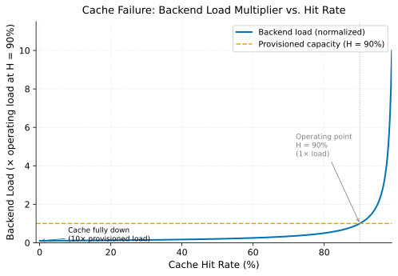

# Cache as Hard Dependency

> **One-liner:** A cache that absorbs 90% of your traffic leaves your backend provisioned for 10% — when the cache fails, the backend sees 10× its designed load.

## Symptom

- Cache cluster failure, restart, or node loss immediately followed by backend error rate spike and CPU saturation.
- Backend metrics look healthy in steady state; dashboards offer no warning before the event.
- p99 latency on the backend spikes to values 10–100× the cache-hit latency.
- Cache-down incidents take far longer to resolve than expected — often requiring manual intervention — because backend overload prevents cache warmup from completing.
- Retry rate increasing as clients see backend errors, further amplifying backend load.

## Mechanism

With a steady-state cache hit rate H, the fraction of traffic reaching the backend is (1 − H). Backends are sized for this fraction; provisioning for full traffic at a high hit rate is usually judged too expensive and is skipped.

The backend load multiplier when the cache fails is:

> **Load multiplier = 1 / (1 − H_normal)**

At H = 0.90: multiplier = 10×. At H = 0.99: multiplier = 100×. This is not a worst-case estimate — it is the exact load the backend sees the moment the cache returns zero hits.

*Figure: Backend load (normalized to the load at the operating hit rate) vs. cache hit rate. The dashed line shows provisioned backend capacity at H = 90%. When the cache fails, backend load crosses this line immediately and continues to 10× normal.*

The sequence of events after cache failure:

1. **T=0:** Cache becomes unavailable (cluster restart, node loss, network partition).
2. **T=0+:** All requests become cache misses. Backend request rate jumps from (1 − H) to 1.0 of total RPS.
3. **T=seconds:** Backend saturates. Queue depth grows. Response latency rises.
4. **T=seconds–minutes:** Clients observe timeouts and errors. They begin retrying. Retry load further amplifies backend traffic. ([Retry Storms](../overload/retry-storms.md))
5. **T=minutes:** Cache may come back online with an empty state. Warming requires backend reads. But backend is overloaded, so cache fill reads fail or time out.
6. **T=minutes–hours:** The system is in a [Metastable Failure](../overload/metastable-failures.md): the sustaining loop (retries keep backends overloaded; backends keep cache fill failing; cache stays cold) persists after the original trigger is gone.

The critical insight is that step 6 cannot self-resolve. The only exit requires external intervention: disabling retries, shedding load, or warming the cache from a snapshot before returning it to traffic.

## Real-world sightings

**Facebook Memcache (Nishtala et al., NSDI 2013).** At Facebook scale, memcache operates at very high hit rates. The paper describes two specific failure modes arising from this dependency: (1) the "thundering herd" — when a popular key expires, all simultaneous misses race to repopulate it from the backend, causing a spike proportional to the number of concurrent readers; and (2) the "cold cluster startup" problem — when a cache cluster comes online after failure with an empty state, the entire cluster's miss traffic routes to the database tier, which is not provisioned for it. Facebook developed the lease mechanism (see [Leases](leases.md)) to address the thundering herd. The cold startup problem required a "gutter pool" — a small set of fallback servers that absorb traffic during warmup.

**AWS Builders' Library.** Amazon's engineering documentation explicitly identifies the cache-as-hard-dependency pattern as a production risk. The essay "Using load shedding to avoid overload" describes the scenario where a cache failure routes all requests to an under-provisioned backend and prescribes shedding requests proportional to the expected miss rate as the correct mitigation — not routing all misses to the backend.

No additional public postmortem with specific metrics has been located at the time of writing. The author should add a first-person sighting here — this pattern is one of the most common causes of sustained cache-related outages.

## Mitigations

### Provision backends for failure scenarios, not steady-state

**What it is:** Size backend capacity for a plausible cache-failure scenario: either the cache-fully-down case (multiplier = 1/(1−H)) or a partial failure (e.g., loss of one of three cache clusters doubles backend load).

**Cost:** Significant idle capacity in steady state. At 90% hit rate and a 10× multiplier, provisioning for cache-down requires 10× the normally-used backend capacity — most of which sits idle.

**How it backfires:** If the hit rate is higher than anticipated (H = 0.99, multiplier = 100×), even "fully provisioned for cache-down" may not be enough. Partial provisioning (e.g., "provision for H = 0.80 failure") still leaves a gap for a complete cache failure.

### Shed load proportional to the miss rate increase

**What it is:** When the cache goes down, detect it immediately (via health check or error rate) and shed the fraction of requests that would have been cache hits. Return fast errors or stale data for those requests rather than routing them to the backend.

**Cost:** During cache failure, the fraction (H) of requests get errors or stale results rather than fresh data. This is a visible degradation but controlled.

**How it backfires:** The shedding fraction must be calibrated to the current hit rate. If the hit rate varies by request type, a single global shed fraction may overshed some paths and undershed others. Returning stale data must be safe for the application — writes and consistency-sensitive reads cannot use stale data.

### Request coalescing at the cache layer

**What it is:** On cache miss, serialize all concurrent requests for the same key through a single backend read. Only one request goes to the backend; the result is written to cache and all waiters receive it.

**Cost:** Waiters see higher latency than if they had hit the cache (they wait for the backend read). Requires synchronization logic.

**How it backfires:** If the backend read fails, all waiters fail together. If the backend read is slow (as it will be during overload), all waiters pile up, defeating the purpose. See [Stampede and Coalescing](stampede-and-coalescing.md) and [Leases](leases.md).

### Cache warmup before serving traffic

**What it is:** After a cache restart, run a prewarming pass — populate the hot key set from backend reads or a saved snapshot — before routing production traffic to the cache.

**Cost:** Delays time-to-recovery; requires maintaining a hot key corpus or snapshot mechanism.

**How it backfires:** The warmup corpus may be stale (access patterns shift). If warmup itself puts load on the backend, it can trigger the same cascade in a softer form. Warmup that takes longer than the client retry window still causes client-visible errors during the warmup period.

## Interactions

- [Retry Storms](../overload/retry-storms.md) — errors from backend overload trigger client retries, multiplying load on an already-saturated backend. Retries prevent cache warming. This is the primary sustaining mechanism for cache-related metastable failures.
- [Metastable Failures](../overload/metastable-failures.md) — cache failure creates the trigger; retry amplification creates the sustaining loop. The system cannot exit without intervention.
- [Cold Restart Warmup](cold-restart-warmup.md) — the recovery path requires cache warmup; retries interfere with it.
- [Stampede and Coalescing](stampede-and-coalescing.md) — during partial recovery, concurrent misses for the same keys amplify backend load further.

## References

- Nishtala, R. et al. "Scaling Memcache at Facebook." *NSDI 2013*.
  The primary reference for this pattern. Sections 3 and 4 cover the thundering herd, the lease mechanism, and the cold cluster startup problem. Required reading before designing any high-throughput caching layer.
- Amazon Web Services. "Using load shedding to avoid overload." *AWS Builders' Library*.
  Describes the shed-on-cache-miss pattern as the correct mitigation for cache failure scenarios.
- Brooker, M. "Metastable Failures in the Wild." *OSDI 2022*.
  Section 3 classifies cache-related cascade failures as a primary category of metastable failure. Includes case study structure applicable to diagnosing this pattern.
