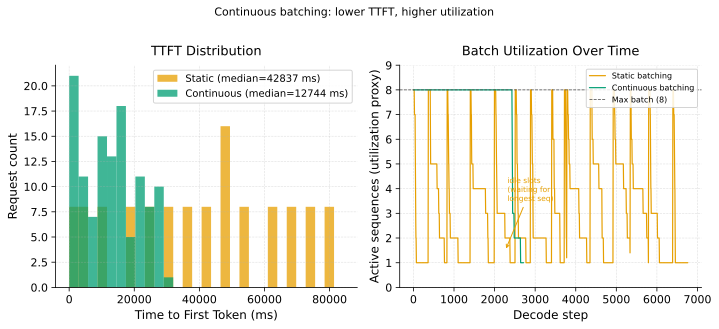

# Continuous Batching

> **One-liner:** Static batching wastes GPU capacity waiting for the longest sequence to finish — iteration-level scheduling inserts new requests at every decode step, keeping the batch full and GPU utilization high regardless of output length variance.

## Symptom

*Static batching in use:*
- GPU utilization low despite pending request queue; compute sits idle between sequence completions.
- Throughput inversely correlated with maximum sequence length in the current batch.
- TTFT low for the first request in a batch; TTFT high for requests that arrive when a batch is mid-decode.
- Short requests finishing quickly but KV slots held until the longest request in the batch completes.

*Continuous batching misconfigured:*
- Preemption rate high (batch too large relative to KV budget).
- TTFT high for new requests (waiting to join an already-full continuous batch).
- ITL higher than expected (batch size exceeding KV bandwidth budget).

## Mechanism

**Static batching inefficiency:**

In static batching, a batch of B sequences is assembled once and processed together from prefill through decode until all B sequences have generated their end-of-sequence token. The batch finishes when the *longest* sequence finishes.

Consider a batch of 4 sequences with output lengths [10, 50, 200, 500] tokens:
- Sequences 1–3 finish at steps 10, 50, 200 respectively.
- Between step 10 and step 500: sequence 1's GPU slot is idle; its KV pages are held.
- Between step 50 and step 500: two-thirds of the batch is idle.
- The batch takes 500 decode steps; effective tokens generated = 10+50+200+500 = 760.
- If the batch had been refilled after each completion: 4 × 500 = 2,000 tokens in the same 500 steps.

The GPU utilization waste is proportional to the *variance* of output lengths, not their mean.

**Continuous batching mechanics (ORCA):**

Iteration-level scheduling (Yu et al., 2022) changes the granularity of scheduling from batch-level to decode-step-level:

1. After every decode step, check if any sequence has completed (generated EOS token).
2. Remove completed sequences from the batch, freeing their KV pages.
3. Admit new requests from the queue (up to the batch size limit and KV budget) into the freed slots.
4. Run the next decode step with the updated batch.

This keeps the batch at maximum size at every step, bounded only by KV memory. A new request waits only for the next completion event (not the end of the entire batch), dramatically reducing TTFT under high load.

**The prefill-decode serialization problem:**

Prefill for a newly admitted sequence must complete before it joins the decode step. This is a large computation (compute-bound, proportional to prompt length) that blocks the decode step for all other sequences while it runs. A 2,000-token prompt takes ~200ms to prefill, during which no other sequence receives a decode step — causing an ITL spike of 200ms for all active streams.

Chunked prefill (Sarathi-Serve) addresses this by splitting prefill into C-token chunks and interleaving one chunk with one decode step per iteration:
- Iteration 1: prefill chunk 1 (C tokens) + one decode step for active sequences.
- Iteration 2: prefill chunk 2 + one decode step.
- ...until prefill is complete.

This bounds the ITL impact of any single prefill to C tokens of prefill time, regardless of prompt length.

The figure shows TTFT distribution and KV memory occupancy under static vs. continuous batching. Continuous batching compresses TTFT for later-arriving requests and keeps KV occupancy more stable.

## Real-world sightings

**Yu, G. et al. "ORCA." (OSDI 2022).** The ORCA paper introduces iteration-level scheduling and demonstrates 2–23× throughput improvement over static batching on GPT-2, GPT-3 (simulated), and OPT models. The improvement is largest on high-variance workloads (wide output length distribution), consistent with the waste-proportional-to-variance analysis. The paper is the definitive reference for continuous batching.

**vLLM open-source deployment.** vLLM implements continuous batching with PagedAttention. Its adoption across the ML serving community (tens of thousands of GitHub stars) and its integration as the default serving backend for Hugging Face TGI confirms that iteration-level scheduling is now the standard for production LLM serving.

## Mitigations

*Continuous batching is itself the mitigation for static batching waste. The following are further optimizations within a continuous batching system.*

### Chunked prefill (Sarathi-Serve)

**What it is:** Split each request's prefill into fixed-size chunks of C tokens. Process one chunk per iteration, interleaved with the decode step for active sequences. This limits the maximum ITL impact of any single admission to C × prefill_cost_per_token.

**Cost:** Total prefill time for a request increases: a P-token prompt takes ceil(P/C) iterations × per-iteration-overhead instead of one continuous prefill pass. Very long prompts take more wall-clock time to fully prefill.

**How it backfires:** Chunk overhead (scheduler invocation, buffer copy between chunks) is non-zero. Setting C too small makes overhead dominate. C must be ≥ several hundred tokens to amortize chunk overhead.

### Batch size tuning for ITL SLO

**What it is:** Choose the maximum continuous batch size based on the ITL SLO: find the largest batch size where decode_step_time ≤ ITL_SLO. Decode step time scales with batch size (more KV cache reads per step, more output projection work). Profile decode step time at several batch sizes; select the operating point.

**Cost:** A smaller batch size means fewer sequences advance per step; throughput (tokens/sec/GPU) decreases.

**How it backfires:** Profiling is hardware-specific; the batch size limit changes with model architecture, quantization, and GPU generation. Must be re-profiled after each model update.

## Interactions

- [KV Cache Pressure](kv-cache-pressure.md) — continuous batching holds the batch full, which maintains steady KV utilization rather than the spiky pattern of static batching; KV budget still limits maximum batch size.
- [Prefill vs. Decode](prefill-vs-decode.md) — continuous batching interleaves prefill admissions with decode; chunked prefill controls the interference; disaggregation separates them entirely.
- [Token-Level SLOs](token-level-slos.md) — continuous batching directly controls TTFT (new requests join sooner) and ITL (batch size determines per-step time); both SLOs are tuned together.
- [Priority and Preemption](priority-and-preemption.md) — continuous batching triggers preemption decisions at every decode step boundary; preemption logic runs in the same scheduling loop.

## References

- Yu, G. et al. "ORCA: A Distributed Serving System for Transformer-Based Generative Models." *OSDI 2022*.
  Introduces iteration-level scheduling; the primary reference for continuous batching mechanics and throughput gains.
- Agrawal, A. et al. "Sarathi-Serve: Efficient LLM Inference by Piggybacking Decodes with Chunked Prefills." *OSDI 2024*.
  Adds chunked prefill to prevent prefill-decode ITL interference; extends ORCA's scheduling model.
