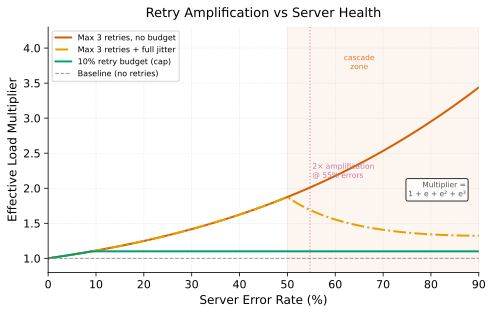

# Retry Storms

> **One-liner:** Clients retrying failed requests multiply load on an already-struggling server, turning a recoverable overload into a collapse — and the multiplier scales with the number of clients.

## Symptom

- Server error rate rising; accepted RPS also rising beyond the nominal request rate.
- Client-side metrics show retry rate climbing (errors per request > 1).
- The service oscillates: partial recovery → retry burst → re-collapse.
- Error rate does not recover when load drops — retries sustain overload even as the original traffic source returns to normal.
- Multiple independent clients all increasing request rate simultaneously (no single caller is responsible).
- Retry storm visible in accepted RPS dashboard as a step increase coinciding with error rate rise.

## Mechanism

When a server is overloaded and returns errors or slow responses, each client independently treats the failure as transient and retries. With N clients each making R retries per failure, the server receives N × R requests instead of N. The retry multiplier converts a partial overload into a full collapse.

*Figure: Effective load multiplier (actual requests / original requests) as a function of server error rate. Without budget controls, three retries can quadruple load at 80% error rate. The budget cap flattens the curve.*

The feedback loop is the critical property:

1. Server at 90% utilization encounters a load spike, error rate rises to 20%.
2. Clients retry 20% of requests → effective load rises by 20%.
3. Higher load → higher error rate (now 35%).
4. Clients retry 35% → effective load rises further.
5. Repeat until either: (a) server saturates completely and clients exhaust retries, or (b) retry budgets kick in and cap the amplification.

Without any budget control, the loop continues until the server is processing almost exclusively retries of retries. The error rate stabilizes near 100% and goodput collapses.

**The distributed nature of the problem** makes it hard to see and hard to stop. Each individual client is behaving correctly — retrying a failed request is the right thing to do for that client in isolation. The problem is coordination: all clients retry at the same time, for the same reason (the server is slow), with no knowledge of each other's retry behavior.

**Retry timing** matters: synchronous retries without jitter create waves. All N clients fail at T, all retry at T + δ, all fail again (the server is still overloaded), all retry at T + 2δ. The waves are coherent, which keeps the server oscillating at high load. See the mitigation on jitter.

## Real-world sightings

**AWS Builders' Library.** The essay "Timeouts, retries, and backoff with jitter" describes a specific scenario at AWS: a fleet of clients retrying with deterministic backoff intervals creates synchronized retry waves that repeatedly overload the server. The essay provides the specific mitigation (full jitter) and quantifies the improvement. The post coins the term "thundering herd" for the synchronized retry case.

**Google SRE Book (Beyer et al., 2016).** Chapter 22 (Cascading Failures) specifically identifies client retries as a primary amplification mechanism in cascading failures. The book describes a case where retry load caused a recovery attempt to fail, extending an outage significantly. The recommended mitigation is a combination of retry budget and exponential backoff.

**Brooker, M. Blog.** The post "Exponential Backoff and Jitter" (AWS Architecture Blog, 2015) demonstrated with simulation that exponential backoff without jitter fails to distribute retry load — clients remain synchronized because they all use the same backoff schedule. Full jitter was shown to reduce maximum retry load by a factor proportional to √N for N clients.

## Mitigations

### Exponential backoff with full jitter

**What it is:** After each failure, delay the next retry by `random(0, min(cap, base × 2^attempt))` — uniformly random across the entire backoff window, not just a jitter fraction added to a fixed delay.

**Cost:** Increases client-visible latency for genuinely transient failures; requires clients to hold request state during the backoff period.

**How it backfires:** Full jitter spreads retries in time but does not reduce their *total* count. At sustained high error rates, all retry intervals eventually fire, just distributed over a longer window. The server load is still multiplied — it's just spread across time. Jitter is necessary but not sufficient.

### Retry budgets

**What it is:** Each client or client fleet tracks the ratio of retries to original requests in a rolling window. Retries are suppressed when the ratio exceeds a budget (e.g., 10% — no more than 1 retry per 10 original requests).

**Cost:** Legitimate transient failures during budget exhaustion are not retried. Requires shared budget tracking across a fleet (not just per-client).

**How it backfires:** Per-client budgets allow each client to retry at 10% independently, so a fleet of 1,000 clients still generates 100 additional requests per 1,000. Fleet-level budgets require coordination. Budgets that reset too frequently still allow bursts.

### Server-signaled backoff (Retry-After)

**What it is:** When overloaded, the server returns a 429 with a `Retry-After` header specifying when to retry, rather than letting clients pick their own schedule.

**Cost:** Requires client compliance; clients that ignore the header still storm.

**How it backfires:** If the server underestimates its recovery time in the Retry-After value, clients retry before recovery is complete, causing another wave. If it overestimates, clients wait unnecessarily.

### Non-idempotent operation protection

**What it is:** For operations that are not safe to retry (writes, payments), require explicit client acknowledgment of each attempt's ID rather than allowing automatic retries.

**Cost:** Significantly more complex client and server code.

**How it backfires:** Clients may not implement idempotency keys correctly; partial retries of large operations can cause inconsistent state.

## Interactions

- [Metastable Failures](metastable-failures.md) — retry storms are the most common sustaining loop. A metastable failure requires a self-sustaining mechanism; retry amplification is that mechanism in most cache and server overload incidents.
- [Goodput Collapse](goodput-collapse.md) — retries amplify the offered load that drives collapse.
- [Cold Restart Warmup](../caching/cold-restart-warmup.md) — retries during cache warmup prevent backends from returning warm hits, sustaining the cold state.
- [Deadline Propagation](deadline-propagation.md) — without deadlines, servers process retried requests that have already exceeded the client timeout, generating more dead work.

## References

- Amazon Web Services. "Timeouts, retries, and backoff with jitter." *AWS Builders' Library*.
  The definitive practical treatment; covers full jitter vs. decorrelated jitter with simulation results.
- Beyer, B. et al. *Site Reliability Engineering*. O'Reilly, 2016.
  Chapter 22 "Cascading Failures" covers retry amplification as a primary failure mode with case studies.
- Brooker, M. "Exponential Backoff and Jitter." *AWS Architecture Blog*, 2015.
  Shows with simulation why deterministic backoff fails; introduces full jitter. Includes the key finding that without jitter, N clients synchronized on the same schedule are indistinguishable from a single client sending N retries.
