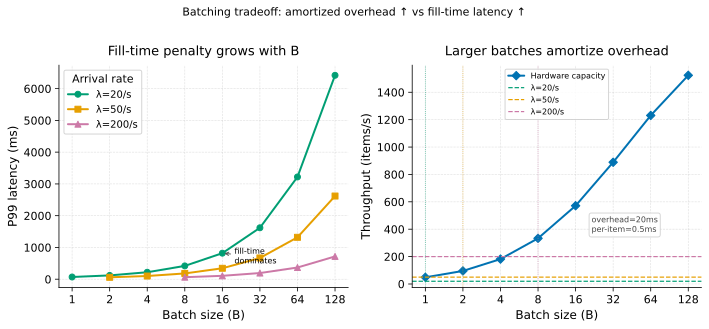

# Batching

> **One-liner:** Processing requests in batches amortizes per-batch overhead and improves throughput — but every batch adds latency for its first item, and the optimal batch size moves with arrival rate.

## Symptom

*Batching absent (not enough batching):*
- Throughput far below hardware capacity; per-item overhead dominates per-item work.
- GPU utilization low; requests processed one at a time when the device can parallelize.
- Per-request latency dominated by fixed overhead (connection setup, memory allocation, kernel call).

*Batching too aggressive:*
- p50 and p99 rising together; first item in each batch waiting for the batch to fill.
- Latency inversely correlated with batch fill rate — lower arrival rate, higher latency.
- At off-peak hours, p99 spikes because batches are never full (fill-time > deadline).

## Mechanism

**The batching tradeoff:**

A batch of size B takes fill_time + processing_time to complete. Items that arrive early in the batch window wait up to fill_time; items that arrive late wait nearly 0 time. Average wait = fill_time / 2.

```
fill_time = B / λ           # seconds to collect B items at arrival rate λ
avg_wait = fill_time / 2    # average queuing latency per item
total_latency = avg_wait + processing_time(B)
```

**Throughput gain from batching:**

Without batching (B=1), each item pays the full per-call overhead C:
```
throughput (no batch) = 1 / (C + work_per_item)
```

With batching (batch size B):
```
throughput (batched) = B / (C + B × work_per_item)
                     = 1 / (C/B + work_per_item)
```

As B → ∞: throughput → 1/work_per_item (overhead fully amortized).

For GPU matrix operations, work_per_item is nearly constant for small B (memory-bandwidth-bound) but decreasing for larger B (compute-bound, parallelized). The effective throughput increases with B until the device's memory or compute is saturated.

**The optimal batch size is arrival-rate-dependent:**

At arrival rate λ and fill time W = B/λ, total per-item latency = W/2 + processing_time(B). As arrival rate decreases:
- fill_time increases (fewer items per second → longer wait to collect B items).
- A batch size that gives 10ms total latency at 1000 items/s gives 500ms at 20 items/s.

This is why static batch sizes fail: a batch size tuned for peak load causes unacceptable latency at off-peak.

**The two triggering conditions:**

Practical batchers use two conditions to flush: (1) batch size reaches B_max, or (2) time since first item exceeds T_max. Whichever fires first triggers processing. This bounds latency at low arrival rate (T_max) while maximizing throughput at high arrival rate (B_max).

```
T_max = maximum acceptable wait for first item ≈ p99 SLO / 4
B_max = max hardware-efficient batch size
```



The figure shows P99 latency and throughput as batch size varies at three arrival rates. Higher arrival rates shift the optimal batch size rightward; low arrival rates make large batches punishing.

## Real-world sightings

**TensorFlow Serving dynamic batching.** TensorFlow Serving implements a dynamic batching scheduler with configurable `max_batch_size` and `batch_timeout_micros` parameters. The timeout ensures that low-traffic periods don't suffer from large-batch fill latency. Google's production serving documentation notes that `batch_timeout_micros` is typically set to 1/4 of the request SLO to bound fill-time latency.

**Database write batching.** MySQL's InnoDB `innodb_flush_log_at_trx_commit=2` and PostgreSQL's `synchronous_commit=off` defer fsync per-transaction, effectively batching writes to the WAL. The batch size is implicit: all writes in the OS buffer between fsyncs. The flush interval (typically 1s or the transaction commit interval) is the fill_time. Throughput increases dramatically; durability guarantee weakens (a crash loses up to fill_time of writes).

## Mitigations

### Time-bounded batching (T_max + B_max)

**What it is:** Flush the batch on whichever condition fires first: (1) batch size reaches B_max, or (2) time elapsed since first item reaches T_max. This gives bounded fill latency at low arrival rate and bounded batch size at high arrival rate.

**Cost:** More complex than static batch size. Requires a background timer to fire T_max.

**How it backfires:** If T_max is set too low relative to processing_time(B_max), every batch flushes at T_max rather than B_max — throughput penalty from under-batching. If T_max is set too high, low-arrival-rate users see unacceptable latency.

### Adaptive batch sizing

**What it is:** Measure the recent arrival rate and compute the optimal batch size dynamically. At high arrival rate, use a large batch; at low arrival rate, use a small batch (or batch size = 1). Adjust B_max every few seconds based on the moving-average arrival rate.

**Cost:** Adaptation lag: if arrival rate changes faster than the adaptation window, the batch size may be wrong for a window. Requires a concurrency-safe arrival rate estimate.

**How it backfires:** Adaptive sizing is unstable under rapid oscillation: the batch size chases the arrival rate, overshooting in each direction. Add damping (exponential moving average with high decay) to prevent oscillation.

### Per-batch priority and preemption

**What it is:** Allow high-priority requests to flush the current batch early (before B_max or T_max) rather than waiting. Priority requests "preempt" the batch fill, paying the cost of a smaller batch to reduce their personal latency.

**Cost:** Reduces batching efficiency for the requests in the preempted batch; they waited for fill time but got a smaller batch than optimal.

**How it backfires:** If high-priority requests are frequent, every batch is preempted and effective batch sizes stay small — eliminating the throughput benefit of batching.

## Interactions

- [Queue Sizing](queue-sizing.md) — the queue between arrival and batch execution must be sized to hold items waiting for the batch to form.
- [Mixed Request Patterns](../multitenancy/mixed-request-patterns.md) — batching items of different sizes in one batch can degrade efficiency; size class batching (separate batches per request type) may be needed.
- [Continuous Batching](../inference/continuous-batching.md) — inference-native evolution of static batching: batches at the iteration level, allowing new requests to join mid-generation.
- [Staged Architectures](staged-architectures.md) — batching is a natural mechanism between pipeline stages; the inter-stage queue accumulates items; the downstream stage pulls in batches.

## References

- TensorFlow Serving documentation. "Batching Configuration." *TensorFlow Extended*.
  Describes `max_batch_size` and `batch_timeout_micros` parameters; the timeout-based flush is the canonical time-bounded batching implementation.
- Dean, J. and Barroso, L.A. "The Tail at Scale." *CACM 56(2)*, 2013.
  Section 3 discusses micro-partitioning and batching in Google's infrastructure; the throughput/latency tradeoff is described in the context of fan-out services.
