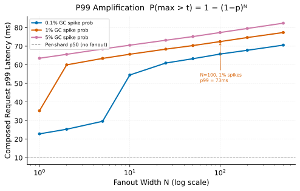

# Fanout Amplification

> **One-liner:** When a request fans out to N backends, the response latency is the maximum across all N — and the effective tail percentile degrades exponentially with fan width.

## Symptom

- Request p99 much higher than per-shard p99: individual shard histograms look healthy, but composed request latency is bad.
- Increasing fanout width (more shards, more index segments) causes p99 to rise even though per-shard work hasn't changed.
- Traces consistently show one slow shard setting the tail for each request, but it's never the same shard twice.
- The worst-case shard dominates: at N=100 shards, the bottom 99 shards finishing in 5ms is irrelevant if one shard takes 200ms.

## Mechanism

When a request fans out to N parallel sub-requests and blocks until all N return, the request latency is:

> **L_request = max(L₁, L₂, ..., L_N)**

The probability that the maximum exceeds threshold t follows from the complement of all N being below t:

> **P(max > t) = 1 − P(all ≤ t) = 1 − (1 − p)^N**

Where p = P(L_i > t) is the per-shard probability of exceeding t. Key consequences:

- At N=1 (no fanout), the effective tail is the per-shard tail: p99 request latency = p99 shard latency.
- At N=10 shards, P(max > t) ≈ 10p for small p. The request p99 corresponds to roughly the per-shard p99.9 (since P(max > t) = 0.01 requires p ≈ 0.001).
- At N=100 shards, the request p99 corresponds to roughly the per-shard p99.99.
- At N=1000 shards (search over a large index), even a per-shard 0.1% slow tail means 63% of all requests hit at least one slow shard.

*Each point shows the p99 latency of the composed (max-of-N) request vs. fan width, given a lognormal per-shard distribution with 1% GC spike probability.*

**The GC spike interaction:** If each shard has a 1% probability of a 50ms GC pause instead of the normal 10ms base latency, the per-shard spike probability is 1%. At N=70 shards: P(at least one GC-pausing shard) = 1 − 0.99^70 = 50%. Half of all requests hit a GC spike on at least one shard. Request p99 latency is now dominated by the GC tail, not the base latency distribution.

**When fanout cannot be reduced:** Some workloads require broad fanout by design:
- Distributed search (query all index shards for recall).
- Scatter-gather aggregations (sum across all partition owners).
- Consensus protocols (wait for a quorum).

For these workloads, per-shard tail latency reduction and hedging are the primary tools.

## Real-world sightings

**Dean, J. and Barroso, L.A., "The Tail at Scale" (CACM 2013).** The paper introduces the fanout amplification problem with a concrete example: a search over 1,000 machines where each machine has a 0.1% probability of a slow response. 63% of all searches will hit at least one slow machine, meaning the request p99 is approximately the per-machine p99.9. This paper is the primary reference for fanout tail latency.

**Barroso, L.A., Clidaras, J., and Hölzle, U. "The Datacenter as a Computer" (2013).** The book discusses how Google's production services manage fanout latency through a combination of hedged requests, bounded queues, and tight per-shard deadlines. The book notes that at datacenter scale, fanout amplification is unavoidable and must be engineered around rather than eliminated.

## Mitigations

### Hedged requests (send-and-cancel)

**What it is:** For each sub-request in the fanout, if the response hasn't arrived within the p_hedge-th percentile of per-shard latency, fire a second copy to a different replica. Accept whichever copy responds first; cancel the other. See [Hedged Requests](hedged-requests.md) for the full treatment including failure modes.

**Cost:** Adds approximately (1 − p_hedge) × N extra requests across the fanout. At hedge threshold p95, adds ~5% extra shard requests. Under overload, this cost increases — see [Hedged Requests](hedged-requests.md).

**How it backfires:** At high shard utilization, hedges frequently fire (because slow responses are common), roughly doubling load on already-saturated shards, accelerating [Goodput Collapse](../overload/goodput-collapse.md).

### Fan-width reduction

**What it is:** Redesign the sharding strategy to reduce the number of shards a single request touches. Options: coarser shards (each shard owns more data), hierarchical fanout (fan to fewer top-level nodes, each of which fans further), or selective shard routing (only query shards that could contain the answer).

**Cost:** Coarser shards reduce parallelism and may create hot shards. Hierarchical fanout adds another layer of latency.

**How it backfires:** Reduced fanout with larger shards shifts the tail source from "one of N shards is slow" to "the one shard queried is slow" — the per-shard variance matters more when N is small.

### Per-sub-request deadline enforcement

**What it is:** Attach a hard deadline to each sub-request; the fanout coordinator returns partial results if not all shards respond within the deadline. The response is less complete but bounded in latency.

**Cost:** Partial results must be handled by callers. Requires communication to callers about result completeness.

**How it backfires:** For workloads where partial results are meaningless (consensus protocols, exact aggregations), returning a partial response is not an option.

## Interactions

- [Hedged Requests](hedged-requests.md) — the primary mitigation; backfires under overload.
- [Deadline Propagation](../overload/deadline-propagation.md) — without per-sub-request deadlines, timed-out fanout subtasks continue running as zombie work.
- [Variance Sources](variance-sources.md) — GC pauses and page faults are the dominant source of the per-shard tail that fanout amplifies.
- [Goodput Collapse](../overload/goodput-collapse.md) — hedging under overload accelerates collapse.

## References

- Dean, J. and Barroso, L.A. "The Tail at Scale." *Communications of the ACM* 56(2), 2013.
  The primary reference. Section 2 derives the fanout math; Section 3 covers mitigations including hedging.
- Barroso, L.A., Clidaras, J., and Hölzle, U. *The Datacenter as a Computer*. Morgan & Claypool, 2013.
  Chapter 3 covers tail latency and fanout in the context of warehouse-scale computing.
