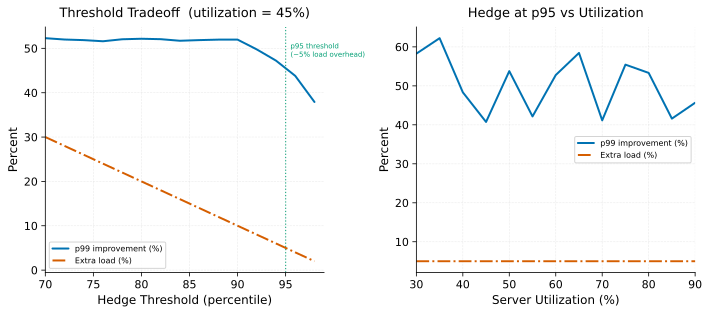

# Hedged Requests

> **One-liner:** Sending a duplicate request after a slow-response threshold improves tail latency at low load but amplifies it under overload — the crossover point is critical and load-dependent.

## Symptom

*Symptoms indicating hedging is appropriate:*
- p99 high relative to p50; p50 is within SLO. (Tail is wide, not median slow.)
- Utilization is low to moderate (< 60–70%).
- Slow responses are stochastic (GC, page faults) — not systemic load.
- Fanout width is high, amplifying per-shard tail.

*Symptoms indicating hedging is hurting rather than helping:*
- Hedging enabled; error rate rising; load increasing.
- Hedged copies completing frequently — the hedge threshold is being hit often, meaning slow responses are systemic, not rare.
- p99 *worse* with hedging enabled at high utilization.
- CPU rising without traffic increase (hedges consuming capacity).

## Mechanism

Hedged requests fire a second copy of a sub-request to a different replica after the first hasn't responded within a threshold — typically the p_hedge-th percentile of recent per-backend latency. Whichever copy responds first is used; the other is cancelled.

**At low utilization:** Slow tail responses (p99) are caused by rare, stochastic events on individual servers: GC pauses, page faults, brief CPU contention. A second copy sent to a different server is very likely to avoid the same stochastic event. The hedge improves p99 at the cost of at most (1 − p_hedge) extra requests: if hedging at p95, 5% of requests generate a second copy, adding 5% load.

**At high utilization:** Slow responses are common because servers are saturated. The hedge threshold is hit frequently. Nearly every request generates a hedge copy. The additional load (approaching 2× in extreme cases) increases server utilization further, slowing responses further, increasing the fraction of requests hitting the hedge threshold — a positive feedback loop toward [Goodput Collapse](../overload/goodput-collapse.md).

*Left: at low utilization (50%), increasing the hedge threshold reduces both the p99 improvement and the load overhead. Right: as utilization rises, the p99 improvement from hedging shrinks while the load overhead grows — the two cross around 70% utilization.*

**The crossover point:** There is a utilization level U_cross at which the p99 improvement from hedging equals the p99 worsening from the extra load. Above U_cross, hedging makes p99 worse. U_cross is typically 60–75% utilization, depending on the latency distribution shape and hedge threshold.

**The cancellation gap:** Even when the first response arrives and the hedge is "cancelled," the cancellation signal may not reach the server in time to stop the hedge request from consuming CPU. The hedge request may complete its work before the cancel arrives. For write-path operations, this can cause duplicate side effects (two inserts, two writes). Hedging is typically safe only for idempotent reads.

**Why hedging is often misapplied:** Engineers observe high p99 and add hedging, seeing an improvement in staging under low load. They deploy to production and observe initial p99 improvement. Under higher load, hedging begins amplifying load; p99 worsens; more hedging fires; cascade. The mistake is that staging load tests don't reproduce production utilization levels.

## Real-world sightings

**Dean, J. and Barroso, L.A., "The Tail at Scale" (CACM 2013).** The paper introduces hedged requests (called "tied requests") and reports that hedging the slowest 1% of sub-tasks at Google reduced 99th percentile latency by 17% at only a ~5% increase in total requests. The paper is careful to note this was measured at low to moderate utilization and explicitly warns about overload conditions.

**Envoy Proxy hedging implementation.** Envoy implements request hedging as an opt-in per-route policy. The Envoy documentation notes that hedging is not recommended for non-idempotent requests and explicitly warns that enabling hedging without load limits can increase server load under slow conditions.

## Mitigations

### Utilization-gated hedging

**What it is:** Only send hedges when measured server utilization (or observed latency) is below a threshold. Disable hedging automatically when the system is in the overload regime.

**Cost:** Requires a reliable, low-latency utilization signal. Adding the condition adds code complexity.

**How it backfires:** Utilization signals lag actual load. A utilization signal that reads below the threshold while the server is actually above it allows hedging to activate during the most dangerous period.

### Cancellation of losing copy (gRPC cancellation)

**What it is:** When the first response arrives, immediately send a cancellation to the outstanding hedge using the protocol's cancellation mechanism (gRPC Context cancellation, HTTP/2 RST_STREAM). The hedge server stops processing when it receives the cancel.

**Cost:** Requires server-side cooperative cancellation (checking context.Done() at yield points). Cancellation is not instantaneous — there is a window between the first response arriving and the cancel reaching the hedge server.

**How it backfires:** Servers that don't implement cooperative cancellation continue executing through the cancel. The cancel reduces the hedge's *output* but not its resource consumption.

### Hedge threshold tuning per latency regime

**What it is:** Set the hedge threshold based on the latency distribution's natural breakpoints, not a fixed percentile. If the distribution is bimodal (fast requests at 5ms, GC-spike requests at 50ms), set the threshold between the modes (e.g., 20ms), not at a fixed percentile. This catches GC spikes without generating hedges on requests that are merely in the slower part of the normal distribution.

**Cost:** Requires latency distribution monitoring; threshold must be updated as the distribution changes.

**How it backfires:** A fixed absolute threshold (e.g., 20ms) that is correct when the server is healthy may be wrong when the server is degraded (all responses at 40ms); hedges fire on every request.

## Interactions

- [Fanout Amplification](fanout-amplification.md) — hedging is the primary tail latency mitigation for high-fanout requests.
- [Goodput Collapse](../overload/goodput-collapse.md) — hedging under overload accelerates collapse; see the interaction map.
- [Variance Sources](variance-sources.md) — hedging is effective against stochastic variance (GC, page faults) but not against systemic slowness.

## References

- Dean, J. and Barroso, L.A. "The Tail at Scale." *Communications of the ACM* 56(2), 2013.
  Section 3 introduces hedged/tied requests, reports the 17% p99 improvement and 5% overhead figures, and warns about overload conditions.
- Envoy Proxy documentation. "Request Hedging." https://www.envoyproxy.io/docs/
  Practical implementation reference; covers idempotency requirements and load limits.
